
<h1 align="center">物流信息管理系统+jsp</h1>

## 简介
物流信息管理系统：角色分为管理员、用户；支持订单管理、收发货地址管理、快递单号查询、运输路线管理、公告管理、用户管理等功能。    --计算机毕业设计源码；毕设源码；java毕业设计源码

## 联系方式

<h3 align="center">获取完整代码与数据库文件 + 微信：deepguan QQ: 86050149 QQ群: 783742310</h3>

<h3 align="center">可帮忙远程部署 包运行成功！提供远程部署、修改代码、设计文档指导、代码讲解等服务！</h3>

## 功能介绍（完整见运行截图）
管理员：登录和注册功能允许管理员访问物流信息管理系统，管理包括订单、公告、用户信息、基础数据、运输路线、收发货地址等。管理员可通过导航栏访问所有模块，支持添加、修改、删除和查询操作，加强物流订单的管理与更新、快递单号的查询、用户信息维护、公告管理以及运输路线优化等。

用户：用户通过登录界面访问系统，支持选择身份为用户或管理员。可使用个人中心查看和编辑个人信息管理，访问订单管理模块进行快递单号查询，以及查询收发货地址等物流信息，用户界面设计直观，便于管理和更新各类物流信息。此外，可利用导航栏进行各个功能模块的快速切换，包括公告浏览和参与，确保信息传递及时有效。

## 运行截图
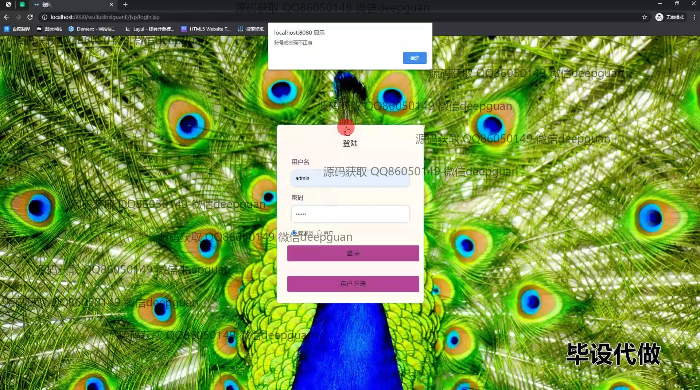
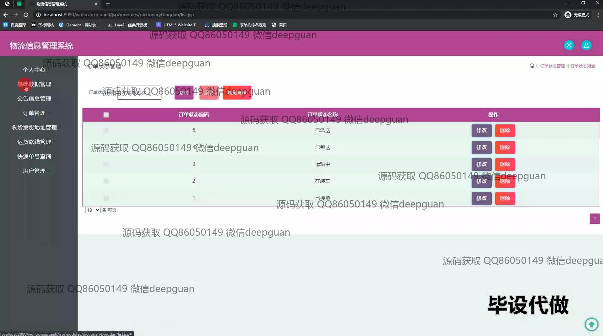
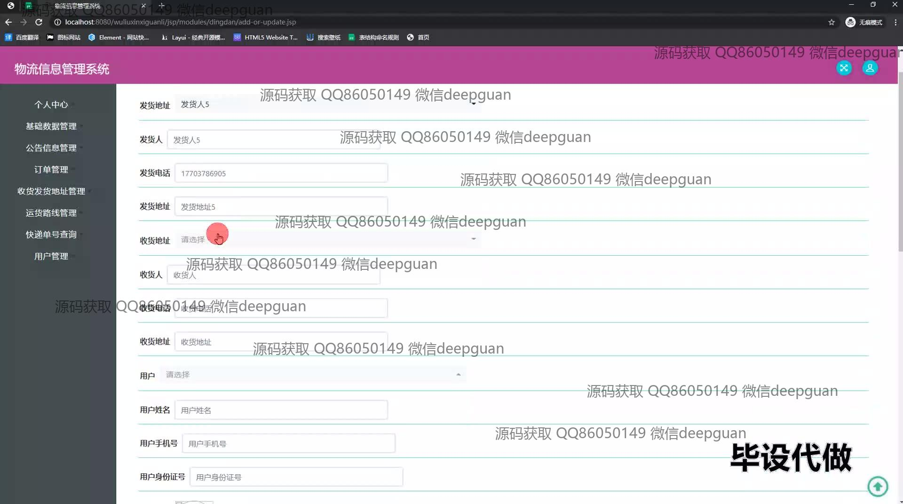
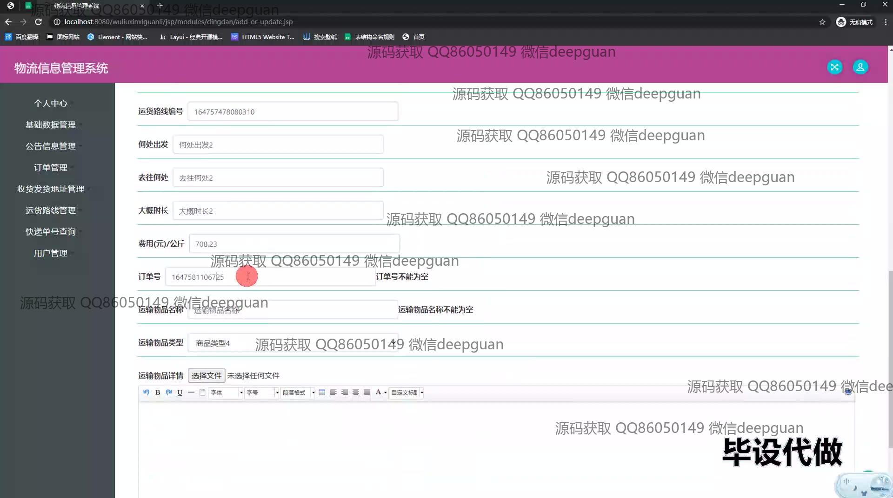
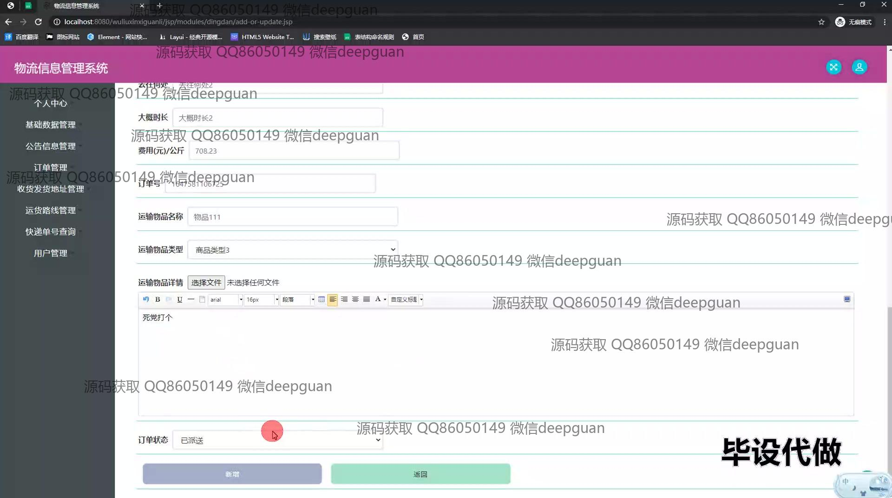
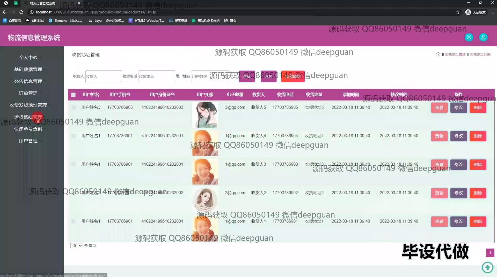
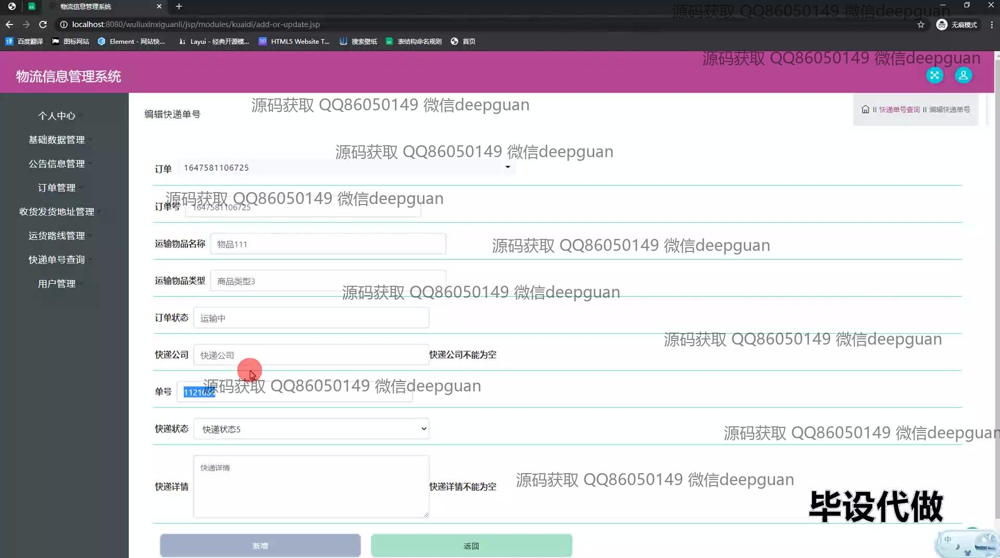
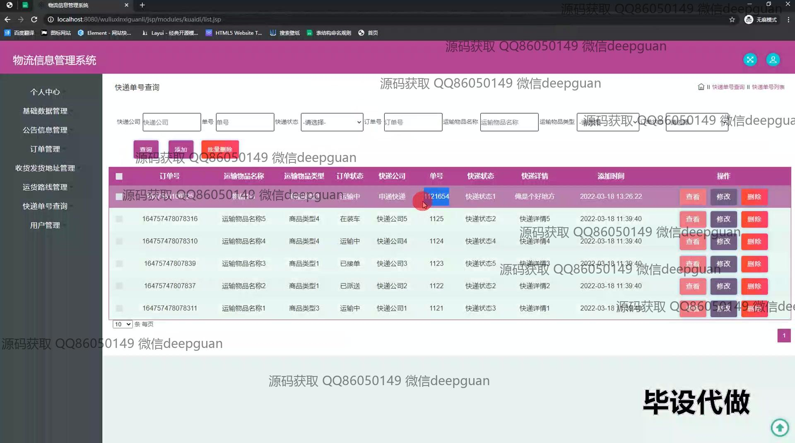
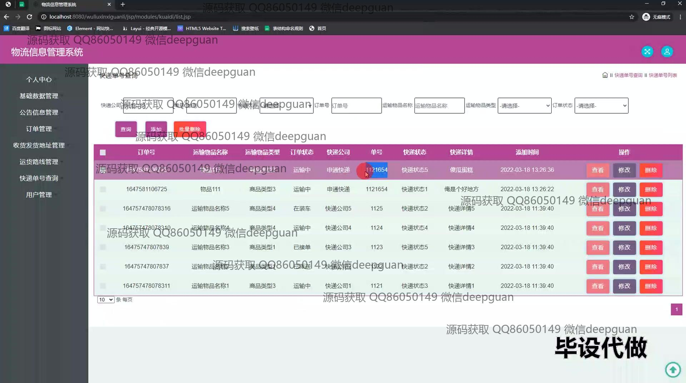
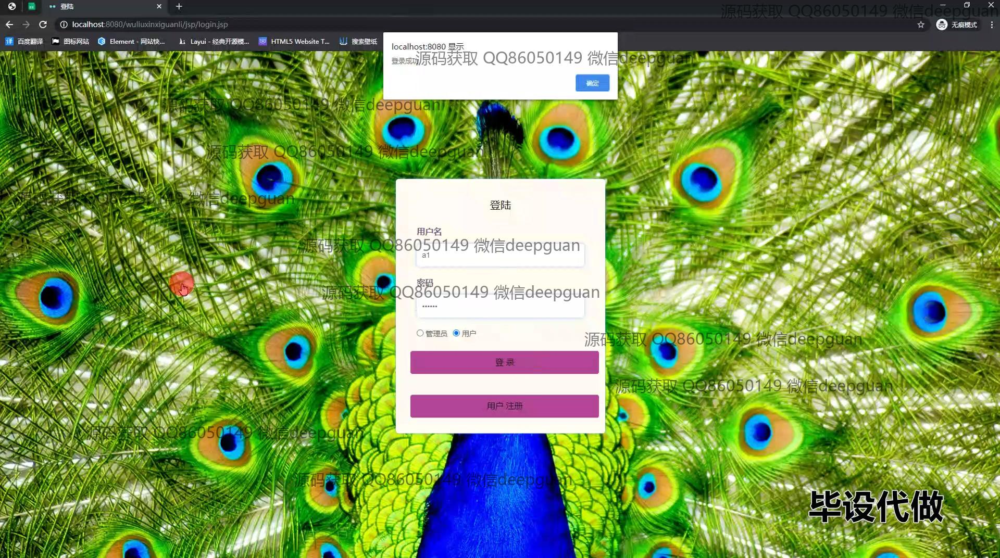
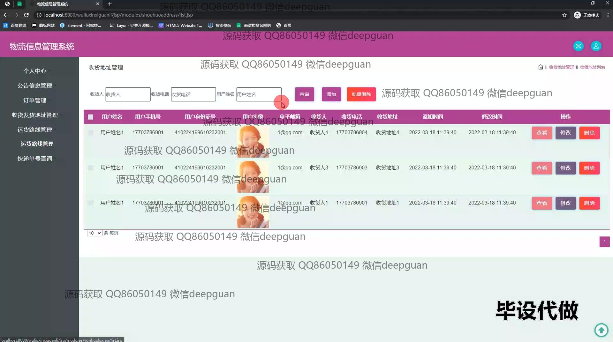
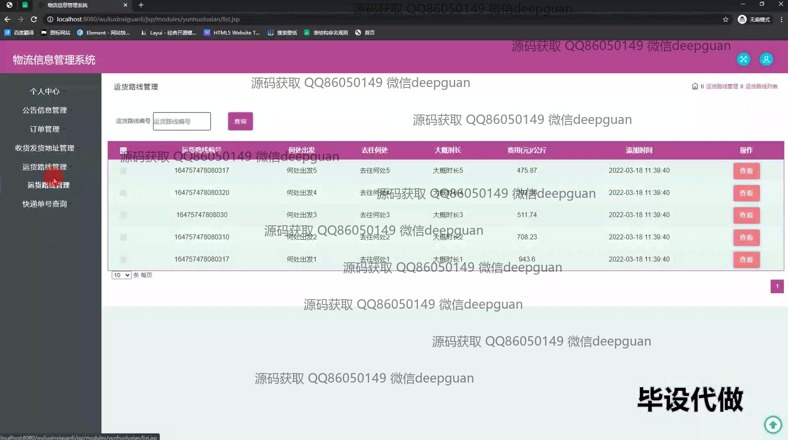
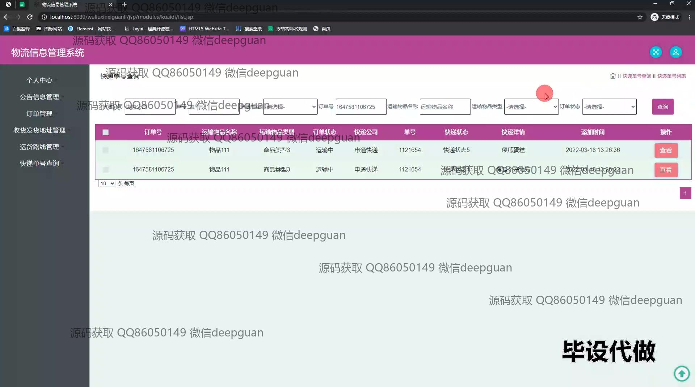

本代码来源于网络,仅供学习参考使用!

